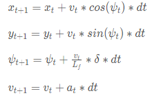
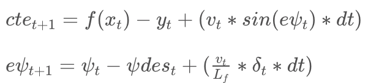

# CarND-Model Predicitve Control
Self-Driving Car Engineer Nanodegree Program

## Introduction

The main goal of the project is to implement the Model Predictive Control in C++ to drive the car and finish the track in a simulator which communicates telemetry and tracks waypoint data via websocket by sending steering and acceleration commands back to the simulator. 

## Model

First, the kinematic model is the basis, with inputs including the vehicle's x and y coordinates, orientation angle (psi), velocity, the cross-track error and psi error (epsi). 

The actuator outputs include acceleration and delta (i.e., steering angle). The model utilizes the state and actuations from the previous timestep to calculate the state at the current timestep. The equations from the Global Kinematic Model are listed below:



In the Model Ppredictive Control model, data about waypoints were transformed into the vehicle space, followed by 3D order polynomial fitting to data. The actual state of the vehicle, with 100 ms latency, can reduce negative effects of the latency and increase stability of the controller, and help simulate real delay of physical actuators. 

The cost function parameters were tuned by try-and-error method, with the values stored in the src/MPC.h file. The objective is to reach maximal speed and agressive race style with use of the whole width of the road and breaking before turns.

Time step duration (dt) was setted equal to the latancy of the simulation (0.1 s), hense, 20 time steps (N) was used.
The timestep evaluation frquency and evaluation period were set up as 10 and 0.1, repspectively, equal to the latency of the simluation as 0.1 s.

There are two kinds of errors: cross track error (cte) and orientation error (eψ):



These error were used to build the cost function for the MPC and updated at the next time step. The parameters of the cost function and other parameters for the Model Predictive Controller are tuned for optimization. Based on the change rate of errors by deriving the kinematic model around these errors, the new state vector [x,y,ψ,v,cte,eψ] can be calculated.

This solution utilized the IPOPT and CPPAD libraries to calculate an optimal trajectory and its associated actuation commands in order to minimize error with a third-degree polynomial fit to the given waypoints. The optimization considers only a short duration's worth of waypoints, and produces a trajectory for that duration based upon a model of the vehicle's kinematics and a cost function based mostly on the vehicle's cross-track error (roughly the distance from the track waypoints) and orientation angle error, with other cost factors included to improve performance.

## Result

The video of result is being placed at:
https://youtu.be/TtvLLuImBD8

---

## Dependencies

* cmake >= 3.5
 * All OSes: [click here for installation instructions](https://cmake.org/install/)
* make >= 4.1(mac, linux), 3.81(Windows)
  * Linux: make is installed by default on most Linux distros
  * Mac: [install Xcode command line tools to get make](https://developer.apple.com/xcode/features/)
  * Windows: [Click here for installation instructions](http://gnuwin32.sourceforge.net/packages/make.htm)
* gcc/g++ >= 5.4
  * Linux: gcc / g++ is installed by default on most Linux distros
  * Mac: same deal as make - [install Xcode command line tools]((https://developer.apple.com/xcode/features/)
  * Windows: recommend using [MinGW](http://www.mingw.org/)
* [uWebSockets](https://github.com/uWebSockets/uWebSockets)
  * Run either `install-mac.sh` or `install-ubuntu.sh`.
  * If you install from source, checkout to commit `e94b6e1`, i.e.
    ```
    git clone https://github.com/uWebSockets/uWebSockets
    cd uWebSockets
    git checkout e94b6e1
    ```
    Some function signatures have changed in v0.14.x. See [this PR](https://github.com/udacity/CarND-MPC-Project/pull/3) for more details.

* **Ipopt and CppAD:** Please refer to [this document](https://github.com/udacity/CarND-MPC-Project/blob/master/install_Ipopt_CppAD.md) for installation instructions.
* [Eigen](http://eigen.tuxfamily.org/index.php?title=Main_Page). This is already part of the repo so you shouldn't have to worry about it.
* Simulator. You can download these from the [releases tab](https://github.com/udacity/self-driving-car-sim/releases).
* Not a dependency but read the [DATA.md](./DATA.md) for a description of the data sent back from the simulator.


## Basic Build Instructions

1. Clone this repo.
2. Make a build directory: `mkdir build && cd build`
3. Compile: `cmake .. && make`
4. Run it: `./mpc`.
